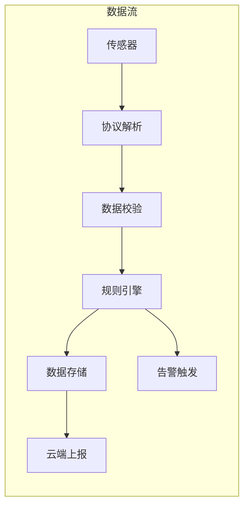
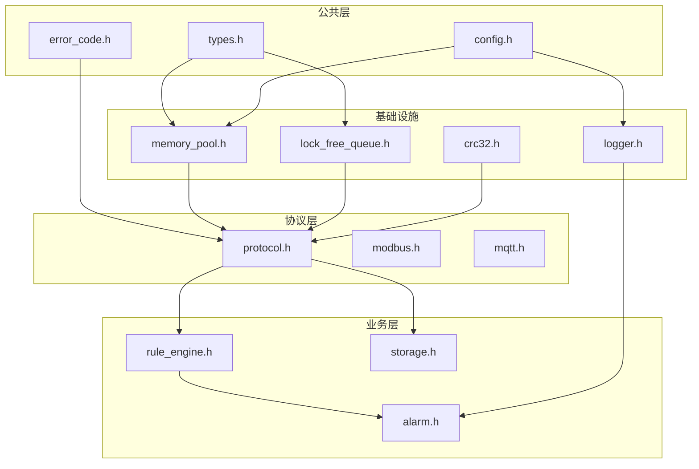

# 模块2: 架构与分层

> **面试金句**: "四层分层架构使驱动层与应用层完全解耦，新增外设支持仅需修改HAL层约200行代码"

## 2.1 嵌入式架构分层

```
┌─────────────────────────────────────────────────────────────┐
│                      应用层 (Application)                    │
│  ┌─────────┐ ┌─────────┐ ┌─────────┐ ┌─────────┐           │
│  │数据采集 │ │规则引擎 │ │配置管理 │ │OTA升级  │           │
│  └────┬────┘ └────┬────┘ └────┬────┘ └────┬────┘           │
├───────┼──────────┼──────────┼──────────┼───────────────────┤
│                      服务层 (Service)                        │
│  ┌─────────┐ ┌─────────┐ ┌─────────┐ ┌─────────┐           │
│  │协议解析 │ │数据缓存 │ │告警管理 │ │日志服务 │           │
│  └────┬────┘ └────┬────┘ └────┬────┘ └────┬────┘           │
├───────┼──────────┼──────────┼──────────┼───────────────────┤
│                      HAL层 (Hardware Abstraction)            │
│  ┌─────────┐ ┌─────────┐ ┌─────────┐ ┌─────────┐           │
│  │GPIO_HAL │ │UART_HAL │ │SPI_HAL  │ │TIMER_HAL│           │
│  └────┬────┘ └────┬────┘ └────┬────┘ └────┬────┘           │
├───────┼──────────┼──────────┼──────────┼───────────────────┤
│                      驱动层 (Driver)                         │
│  ┌─────────┐ ┌─────────┐ ┌─────────┐ ┌─────────┐           │
│  │DMA驱动  │ │中断管理 │ │时钟配置 │ │外设驱动 │           │
│  └─────────┘ └─────────┘ └─────────┘ └─────────┘           │
├─────────────────────────────────────────────────────────────┤
│                      硬件 (STM32H743)                        │
│  ARM Cortex-M7 @ 480MHz | 1MB Flash | 1MB RAM | FPU         │
└─────────────────────────────────────────────────────────────┘
```

## 2.2 Linux后端架构

```
┌─────────────────────────────────────────────────────────────┐
│                      API网关层                               │
│  ┌──────────────────────────────────────────────────────┐   │
│  │  HTTP/WebSocket | 认证鉴权 | 限流熔断 | 负载均衡      │   │
│  └──────────────────────────────────────────────────────┘   │
├─────────────────────────────────────────────────────────────┤
│                      业务服务层                              │
│  ┌─────────┐ ┌─────────┐ ┌─────────┐ ┌─────────┐           │
│  │设备管理 │ │数据处理 │ │规则引擎 │ │告警服务 │           │
│  └────┬────┘ └────┬────┘ └────┬────┘ └────┬────┘           │
├───────┼──────────┼──────────┼──────────┼───────────────────┤
│                      核心框架层                              │
│  ┌─────────────────────────────────────────────────────┐    │
│  │  epoll反应堆 | 无锁队列 | 对象池 | 定时器轮          │    │
│  └─────────────────────────────────────────────────────┘    │
├─────────────────────────────────────────────────────────────┤
│                      基础设施层                              │
│  ┌─────────┐ ┌─────────┐ ┌─────────┐ ┌─────────┐           │
│  │内存管理 │ │日志系统 │ │配置中心 │ │监控指标 │           │
│  └─────────┘ └─────────┘ └─────────┘ └─────────┘           │
└─────────────────────────────────────────────────────────────┘
```

## 2.3 核心组件交互



## 2.4 头文件依赖图



## 2.5 线程模型 (Linux)

```c
/*
 * Linux多线程反应堆架构
 * 
 * Main Thread: 初始化 + 信号处理
 *     │
 *     ├── Accept Thread: 连接接受 (1个)
 *     │       └── 新连接分发到Worker
 *     │
 *     ├── Worker Thread Pool: IO处理 (CPU核数个)
 *     │       ├── epoll_wait 事件循环
 *     │       ├── 协议解析
 *     │       └── 业务处理
 *     │
 *     ├── Timer Thread: 定时任务 (1个)
 *     │       ├── 心跳检测
 *     │       ├── 超时清理
 *     │       └── 统计上报
 *     │
 *     └── Async IO Thread: 异步写入 (1个)
 *             └── 日志/存储异步落盘
 */

// 线程间通信: 无锁队列
// 共享数据: RWLock保护
// 内存分配: 线程本地对象池
```

## 2.6 任务模型 (FreeRTOS)

```c
/*
 * FreeRTOS任务优先级设计
 * 
 * Priority 7 (Highest): ISR相关
 *     └── DMA完成回调
 * 
 * Priority 6: 硬实时任务
 *     └── 数据采集任务 (10ms周期)
 * 
 * Priority 5: 软实时任务
 *     └── 协议处理任务
 * 
 * Priority 4: 普通任务
 *     ├── 规则引擎任务
 *     └── 告警处理任务
 * 
 * Priority 3: 后台任务
 *     ├── 网络通信任务
 *     └── 日志任务
 * 
 * Priority 1 (Lowest): 空闲任务
 *     └── 看门狗喂狗
 */

// 任务间通信: 队列 + 信号量
// 临界区: taskENTER_CRITICAL
// 优先级反转: 互斥量带优先级继承
```
