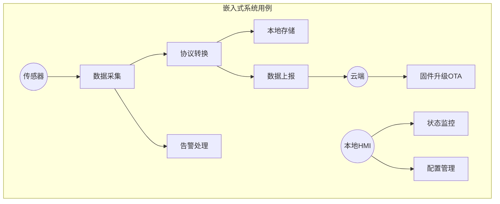
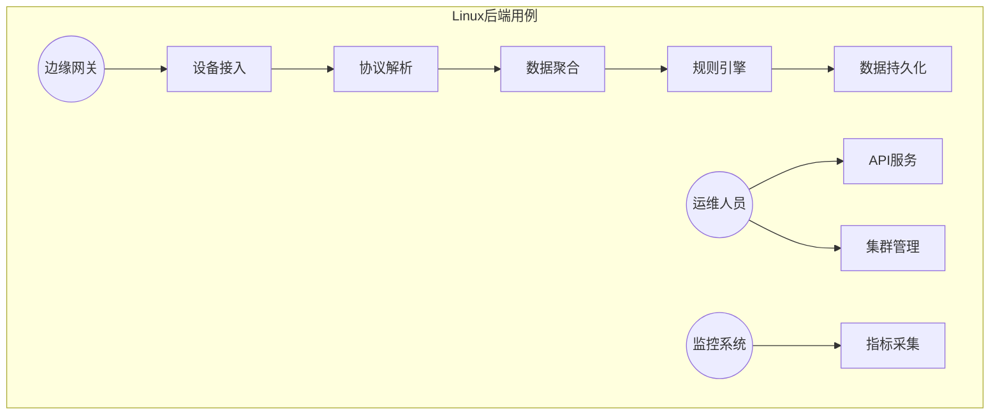

# 模块1: 需求与用例

> **面试金句**: "需求分析阶段识别出23个用例，其中6个高优先级用例决定了双平台分层架构设计"

## 1.1 嵌入式用例图 (UML)



## 1.2 Linux后端用例图 (UML)



## 1.3 功能性需求 (FR)

| 编号 | 需求描述 | 优先级 | 验收标准 |
|------|----------|--------|----------|
| **FR-001** | 多协议数据采集 | P0 | 支持Modbus RTU/TCP、MQTT、自定义二进制协议，采集周期≤10ms |
| **FR-002** | 边缘计算规则引擎 | P0 | 支持≥100条规则并发执行，单规则执行时间<1ms |
| **FR-003** | 数据断点续传 | P1 | 网络中断后本地缓存≥10000条记录，恢复后自动上传，数据零丢失 |

### FR-001 详细说明
```
输入: 传感器原始数据流(Modbus帧、MQTT消息、二进制包)
处理: 协议解析 -> 数据校验 -> 格式标准化 -> 时间戳对齐
输出: 统一JSON格式数据结构
约束: 
  - 嵌入式: 同时支持4路串口采集
  - Linux: 同时支持10000个TCP连接
```

### FR-002 详细说明
```
输入: 标准化数据 + 规则配置
处理: 规则匹配 -> 条件判断 -> 动作执行
输出: 告警事件、控制指令、聚合结果
规则示例:
  IF temperature > 85 AND duration > 30s THEN alarm(CRITICAL) AND notify(SMS)
```

### FR-003 详细说明
```
输入: 待上传数据队列
处理: 网络检测 -> 本地持久化 -> 断点标记 -> 恢复重传
输出: 上传确认ACK
存储策略:
  - 嵌入式: SPI Flash循环写入，FIFO淘汰
  - Linux: 本地SQLite + WAL模式
```

## 1.4 非功能性需求 (NFR)

| 编号 | 需求描述 | 指标 | 测试方法 |
|------|----------|------|----------|
| **NFR-001** | 高性能 | Linux: ≥50W QPS, TP99<5ms; 嵌入式: 中断延迟<5µs | wrk压测 / 逻辑分析仪 |
| **NFR-002** | 高可靠 | MTBF≥8760h(1年), 内存泄漏0 | Valgrind 720h连续测试 |
| **NFR-003** | 低资源 | 嵌入式: RAM≤320KB, ROM≤1MB; Linux: 内存≤512MB | 编译器报告 / top监控 |

### NFR-001 性能指标分解

```
┌─────────────────────────────────────────────────────────────┐
│                    性能指标金字塔                            │
├─────────────────────────────────────────────────────────────┤
│  Level 1: 系统级                                            │
│    - Linux QPS: 500,000 req/s                               │
│    - 嵌入式采集频率: 100 Hz                                  │
├─────────────────────────────────────────────────────────────┤
│  Level 2: 模块级                                            │
│    - 协议解析: <100µs/packet                                │
│    - 规则执行: <1ms/rule                                    │
│    - 内存分配: <500ns (对象池)                               │
├─────────────────────────────────────────────────────────────┤
│  Level 3: 函数级                                            │
│    - CRC32计算: <10µs/KB                                    │
│    - 队列操作: <100ns (无锁)                                 │
│    - 内存拷贝: DMA零拷贝                                     │
└─────────────────────────────────────────────────────────────┘
```

### NFR-002 可靠性保障

```c
// 可靠性设计原则
typedef struct {
    // 1. 防御性编程
    uint32_t magic;           // 魔数校验
    uint32_t crc;             // 数据校验
    
    // 2. 故障隔离
    uint8_t watchdog_enabled; // 看门狗
    uint8_t error_recovery;   // 错误恢复
    
    // 3. 状态监控
    uint64_t heartbeat;       // 心跳时间戳
    uint32_t error_count;     // 错误计数
} reliability_context_t;
```

### NFR-003 资源预算

| 模块 | RAM(KB) | ROM(KB) | CPU(%) |
|------|---------|---------|--------|
| 内存池 | 64 | 8 | 2 |
| 协议栈 | 32 | 48 | 15 |
| 规则引擎 | 48 | 64 | 20 |
| 网络驱动 | 24 | 32 | 10 |
| 应用层 | 32 | 96 | 5 |
| FreeRTOS | 18 | 24 | - |
| **合计** | **218** | **272** | **52** |

## 1.5 需求追踪矩阵

| 需求ID | 设计模块 | 测试用例 | 代码文件 |
|--------|----------|----------|----------|
| FR-001 | 协议层 | TC_PROTO_* | protocol.c |
| FR-002 | 规则引擎 | TC_RULE_* | rule_engine.c |
| FR-003 | 存储层 | TC_STORE_* | storage.c |
| NFR-001 | 全局 | PERF_* | benchmark.c |
| NFR-002 | 全局 | REL_* | reliability.c |
| NFR-003 | 内存管理 | MEM_* | memory_pool.c |
